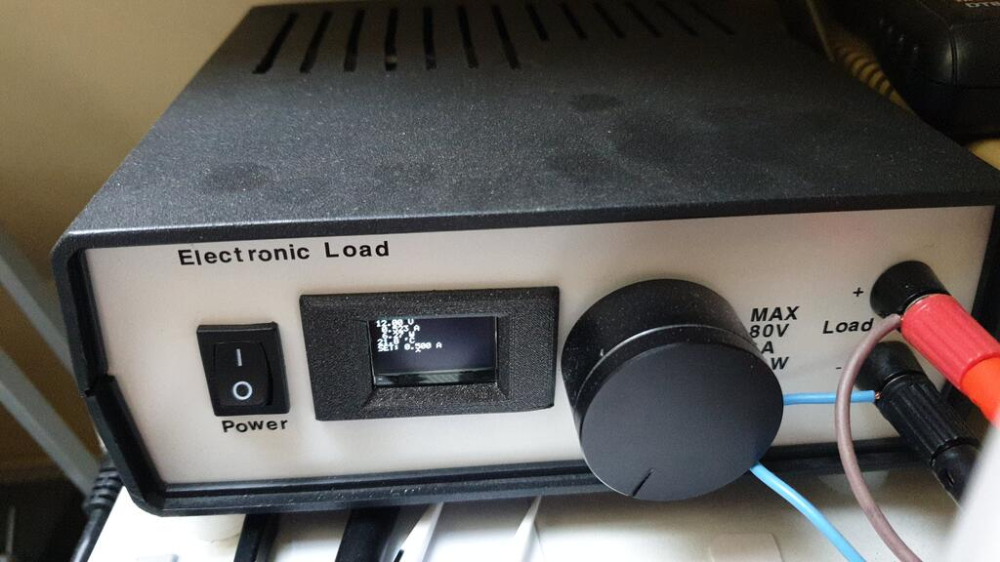
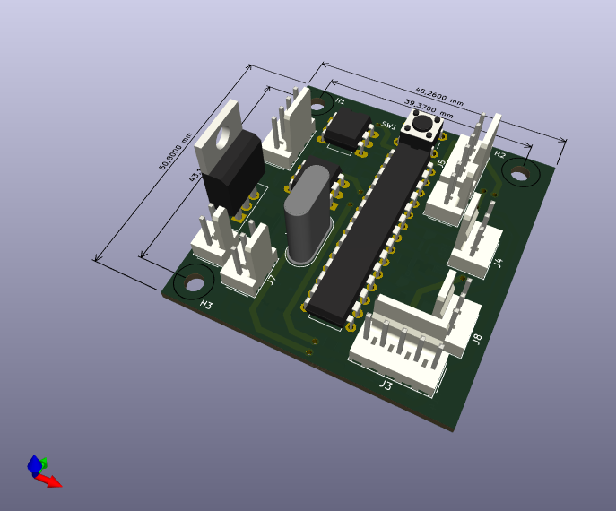
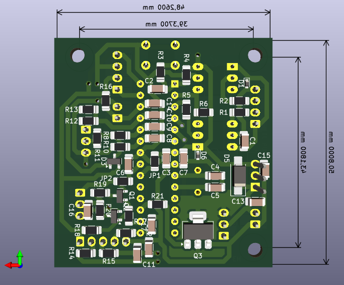

# Electronic load
This repository contains hardware designs and firmware for my electronic load.

## Hardware

This project is based on an analog electronic load PCB from Aliexpress:
XHDZ-FZ-2g.
Originally, I just put it in a box and used it as-is with a 10-turn
potentiometer. However, then the pot failed, and I decided to upgrade it with
digital control. The control loop is still analog utilising the original
circuitry, but the reference signal is generated by a microcontroller instead
of the potentiometer.

My `electronic-load-controller` PCB contains an ATmega8 microcontroller,
a PWM DAC to generate the reference voltage, UART optoisolators for remote
control, and circuitry for measuring the load voltage and current.
It connects to the analog PCB via the original connectors with just one wire
needing to be soldered to a non-standard pad on the board.

The user interface consists of an SSD1306 OLED display and a rotary encoder.

Space for improvement: I didn't spend much time designing the user interface
and as a result, I had to use a small font that is hard to read from a
distance.

## Software
The firmware on the ATmega microcontroller performs several functions.
It measures the voltage across the load, the load current, calculates the
power loss and implements over-power protection, monitors the heatsink
temperature and controls the cooling fan.
It uses the DAC to generate the current setpoint signal for the analog board
based on the value set by the user via the rotary encoder,
and it implements a SCPI interface on the serial port for remote control
capability.

### SCPI commands
A text-based remote control interface is available on the serial port (9600
baud, 8N1).

The following table explains the individual command (`v` is a placeholder for
an integer argument).

| command       | description                                                   |
|:-------------:|:--------------------------------------------------------------|
| `ISET v`      | Set load current. E.g. `ISET 1000` sets the current to 1A.    |
| `ISET?`       | Get load current setpoint value in mA.                        |
| `IGAIN v`     | Settings: set conversion coefficient for current measurement. |
| `IGAIN?`      | Settings: get `IGAIN` value.                                  |
| `VGAIN v`     | Settings: set conversion coefficient for voltage measurement. |
| `VGAIN?`      | Settings: get `VGAIN` value.                                  |
| `SPGAIN v`    | Settings: set conversion coefficient for current setpoint.    |
| `SPGAIN?`     | Settings: get `SPGAIN` value.                                 |
| `SPOFF v`     | Settings: set conversion offset for current setpoint.         |
| `SPOFF?`      | Settings: get `SPOFF` value.                                  |
| `DUTY?`       | Get PWM DAC duty cycle value. Useful for debugging.           |
| `I?`          | Get measured current in A.                                    |
| `V?`          | Get measured voltage in V.                                    |
| `P?`          | Get measured power in W.                                      |
| `TEMP?`       | Get heatsink temperature in degrees C.                        |
| `*BOOTLOADER` | Jump to bootloader to allow updating firmware.                |
| `*SAV`        | Save settings to EEPROM.                                      |
| `*RST`        | Reset the microcontroller.                                    |

### Calibration
Calibration is performed using SCPI commands on the serial interface.
The goal is to make the load current and voltage readings accurate
and to make the current setpoint match the actual load current.

TODO document calibration procedure.
